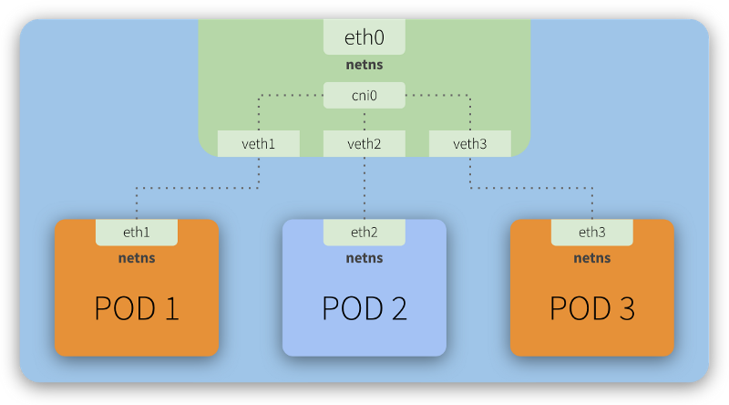

# K8S Bare Metal - Learning
The purpose of this document is log my journey understanding and administering a bare-metal k8s cluster, which monitoring via Prometheus + Grafana for a simple API application. The steps involved but not limited to:

- Deploying a control plane on the local machine (kube-apiserver, kube-controller, kube-scheduler and etcd)
- Defining the network topology and CNI overlay integration between the master node and worker node utilising flannel as the container fabric
- Deployment of VMs and simulating autoscaling of the cluster through the use of libvirt for virtualization management.

## Cluster Networking
The key principles when considering the k8s network model follows a few basic assumptions, those being:

1. Pods are all able to communicate with one another without the need of to make use of Network Address Translation (NAT)
2. Nodes can either be physical or virtual and are able to communicate with all pods without the need for NAT
3. Each Pod will see itself with the same IP that other Pods see it as vi its NIC (No NAT translation to localhost)



The above diagram shows a high level overview of node communication can be handled in this instance

TODO

```
1: lo: <LOOPBACK,UP,LOWER_UP> mtu 65536 qdisc noqueue state UNKNOWN group default qlen 1000
    link/loopback XX:XX:XX:XX:XX:XX brd XX:XX:XX:XX:XX:XX
    inet 127.0.0.1/8 scope host lo
       valid_lft forever preferred_lft forever
    inet6 ::1/128 scope host noprefixroute 
       valid_lft forever preferred_lft forever
2: enp7s0: <BROADCAST,MULTICAST,UP,LOWER_UP> mtu 1500 qdisc fq_codel state UP group default qlen 1000
    link/ether XX:XX:XX:XX:XX:XX brd ff:ff:ff:ff:ff:ff
    altname enxXXXXXXXXXXXX
    inet 192.168.50.3/24 brd 192.168.50.255 scope global dynamic noprefixroute enp7s0
       valid_lft 83133sec preferred_lft 83133sec
    inet6 fe80::XXXX:XXXX:XXXX:XXXX/64 scope link noprefixroute 
       valid_lft forever preferred_lft forever
3: flannel.1: <BROADCAST,MULTICAST,UP,LOWER_UP> mtu 1450 qdisc noqueue state UNKNOWN group default 
    link/ether XX:XX:XX:XX:XX:XX brd ff:ff:ff:ff:ff:ff
    inet 10.244.0.0/32 scope global flannel.1
       valid_lft forever preferred_lft forever
    inet6 fe80::XXXX:XXXX:XXXX:XXXX/64 scope link proto kernel_ll 
       valid_lft forever preferred_lft forever
4: cni0: <BROADCAST,MULTICAST,UP,LOWER_UP> mtu 1450 qdisc noqueue state UP group default qlen 1000
    link/ether XX:XX:XX:XX:XX:XX brd ff:ff:ff:ff:ff:ff
    inet 10.244.0.1/24 brd 10.244.0.255 scope global cni0
       valid_lft forever preferred_lft forever
    inet6 fe80::XXXX:XXXX:XXXX:XXXX/64 scope link proto kernel_ll 
       valid_lft forever preferred_lft forever
5: vethb53e97ea@if2: <BROADCAST,MULTICAST,UP,LOWER_UP> mtu 1450 qdisc noqueue master cni0 state UP group default 
    link/ether XX:XX:XX:XX:XX:XX brd ff:ff:ff:ff:ff:ff link-netns cni-c16ec664-0ae5-76a3-97f7-c7ee3b15aa98
    inet6 fe80::XXXX:XXXX:XXXX:XXXX/64 scope link proto kernel_ll 
       valid_lft forever preferred_lft forever
6: veth52cbbed4@if2: <BROADCAST,MULTICAST,UP,LOWER_UP> mtu 1450 qdisc noqueue master cni0 sta_

```
  
### References
1. https://libvirt.org/manpages/libvirtd.html
2. https://github.com/flannel-io/flannel# k8s-bare-metal
